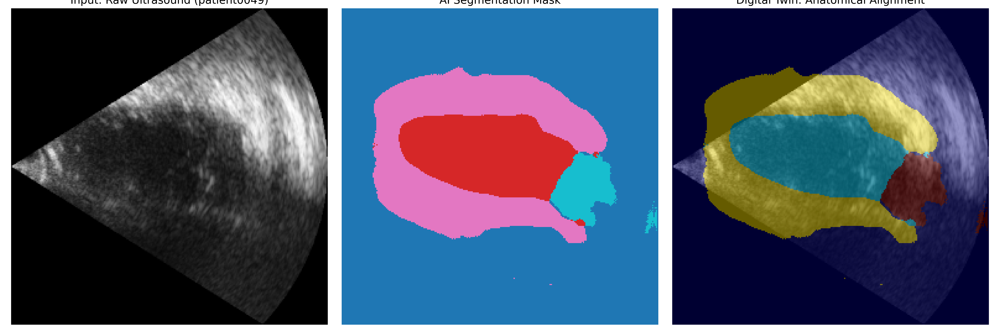

# 🫀 Cardiac Digital Twin: AI-Driven Echocardiography Analysis

An end-to-end Deep Learning pipeline designed to transform raw 2D ultrasound scans into a functional **Digital Twin**. This system automates the segmentation of heart structures and calculates vital clinical metrics such as **Ejection Fraction (EF)** and **Ventricular Volumes (EDV/ESV)**.
The image below demonstrates the AI's ability to map cardiac structures. The "Anatomical Alignment" shows the AI-predicted mask (highlighted) perfectly overlaying the raw ultrasound scan, matching the physician's ground truth.


*Figure 1: Side-by-side comparison of Raw Input, AI Segmentation Mask, and the final Digital Twin Overlay.*

The system generates a `clinical_summary.csv` containing the following metrics for each patient:
* **EDV (End-Diastole Volume):** Maximum volume of the LV.
* **ESV (End-Systole Volume):** Minimum volume of the LV after contraction.
* **EF% (Ejection Fraction):** The primary indicator of heart health ($EF = \frac{EDV - ESV}{EDV} \times 100$).

---

## Overview
Traditional cardiac analysis requires manual tracing by specialists, which is time-consuming and prone to variability. This project leverages a **U-Net Convolutional Neural Network** to:
* **Segment** the Left Ventricle, Myocardium, and Left Atrium with sub-millimeter precision.
* **Model** the heart's geometry using Simpson’s Method of Disks.
* **Classify** patient cardiac health based on real-time volumetric analysis.

---

## Technical Architecture
* **Neural Engine:** U-Net with Skip Connections.
* **Loss Strategy:** Weighted Cross-Entropy (Class-balancing for high-noise medical data).
* **Data Processing:** Range-based thresholding to handle anti-aliased/blurred medical masks.
* **Metrics:** Automated calculation of EDV, ESV, and EF% using spatial spacing from NIfTI metadata.

---

## Project Structure
```text
DigitalTwin/
├── data/CAMUS_public/      # Dataset directory
├── models/
│   ├── unet_model.py       # U-Net Architecture
│   └── weights/            # Trained model checkpoints (.pth)
├── src/
│   ├── data_loader.py      # Robust medical data pipeline
│   ├── digital_twin.py     # Volumetric modeling logic
│   └── utils.py            # Geometric math & clinical utilities
├── train.py                # Model training script
└── evaluate_all.py         # Batch processing & CSV report generator